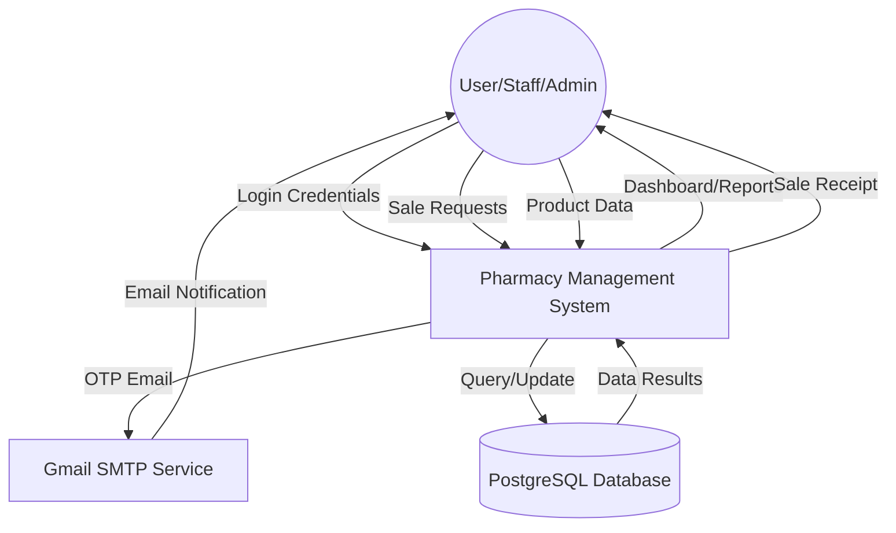
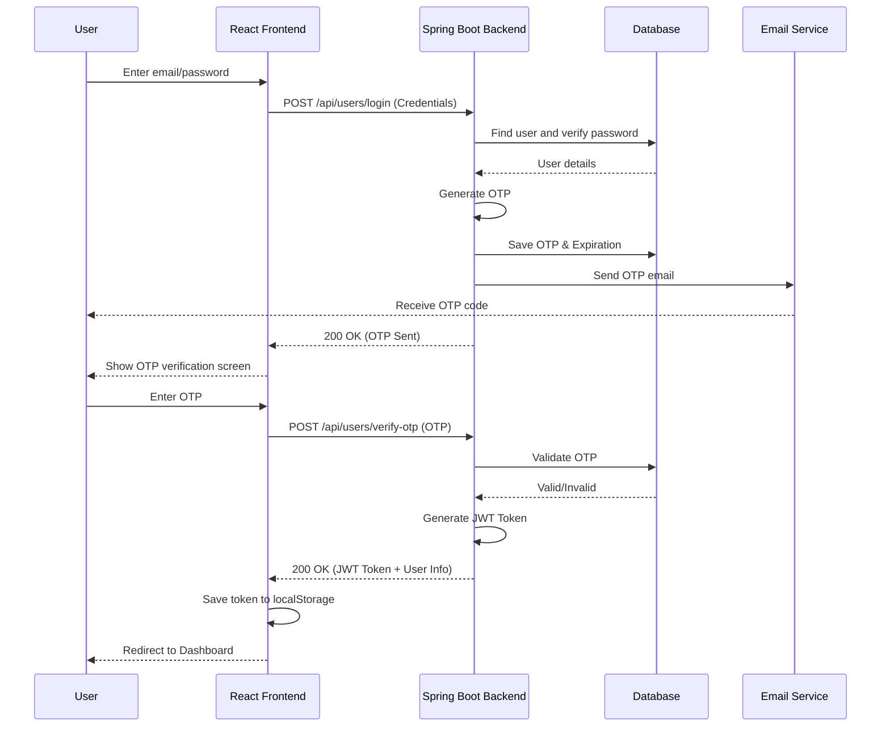
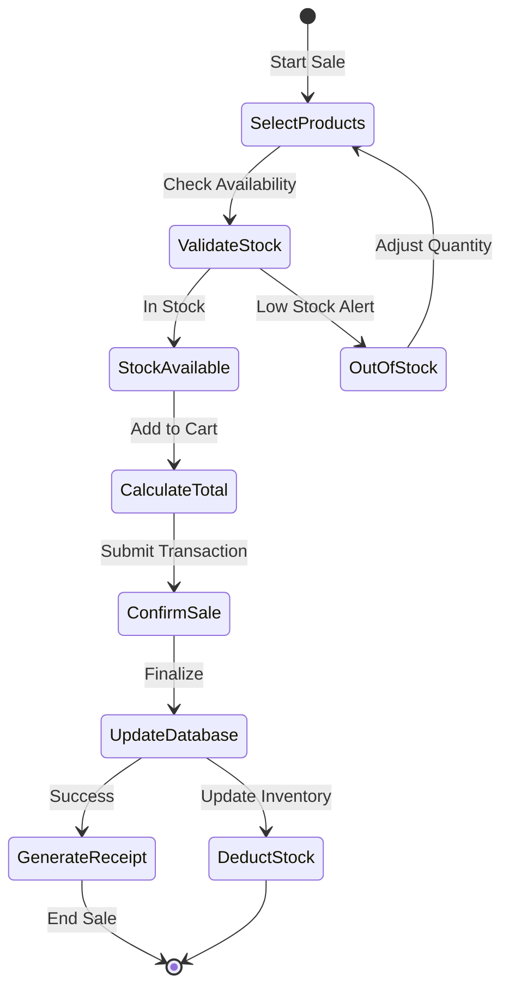
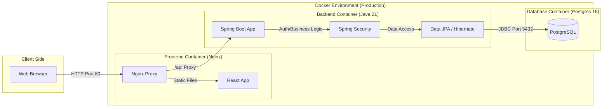

# System Diagrams - Pharmacy Management System

This document contains the structural and behavioral diagrams for the Pharmacy Management System. You can use these descriptions and Mermaid code to create professional diagrams for your presentation.

---

## 1. Use Case Diagram

The Use Case Diagram describes the functional requirements of the system from the perspective of different users.

### Mermaid Code
```mermaid
useCaseDiagram
    actor Admin
    actor Staff
    actor User

    package "Pharmacy Management System" {
        usecase "Login & Authentication" as UC1
        usecase "Manage Products" as UC2
        usecase "Monitor Inventory" as UC3
        usecase "Process Sales" as UC4
        usecase "Manage Suppliers" as UC5
        usecase "Generate Reports" as UC6
        usecase "Manage Users" as UC7
        usecase "View Personal Profile" as UC8
    }

    User --> UC1
    User --> UC8

    Staff --> UC1
    Staff --> UC2
    Staff --> UC3
    Staff --> UC4
    Staff --> UC8

    Admin --> UC1
    Admin --> UC2
    Admin --> UC3
    Admin --> UC4
    Admin --> UC5
    Admin --> UC6
    Admin --> UC7
    Admin --> UC8
```

---

## 2. Data Flow Diagram (Level 0 - Context Diagram)

The Data Flow Diagram (DFD) maps out the flow of information for the pharmacy management process.

### Mermaid Code


---

## 3. Sequence Diagram (User Login with OTP)

This diagram shows the interaction between components during a secure login session.

### Mermaid Code


---

## 4. Activity Diagram (Processing a Sale)

The Activity Diagram shows the step-by-step workflow of a business process.

### Mermaid Code


---

## 5. System Architecture Diagram

This diagram shows the physical/logical components of the Dockerized environment.

### Mermaid Code


---

## Instructions for Presentation

1. **Use Mermaid Live Editor**: Go to [mermaid.live](https://mermaid.live/) and paste the code segments above.
2. **Export as Image**: Download the resulting diagrams as PNG or SVG.
3. **Paste in Slides**: Insert these images into your PowerPoint/Google Slides presentation.
4. **Explain the Flow**: During the presentation, use these diagrams to explain how the system works internally.
